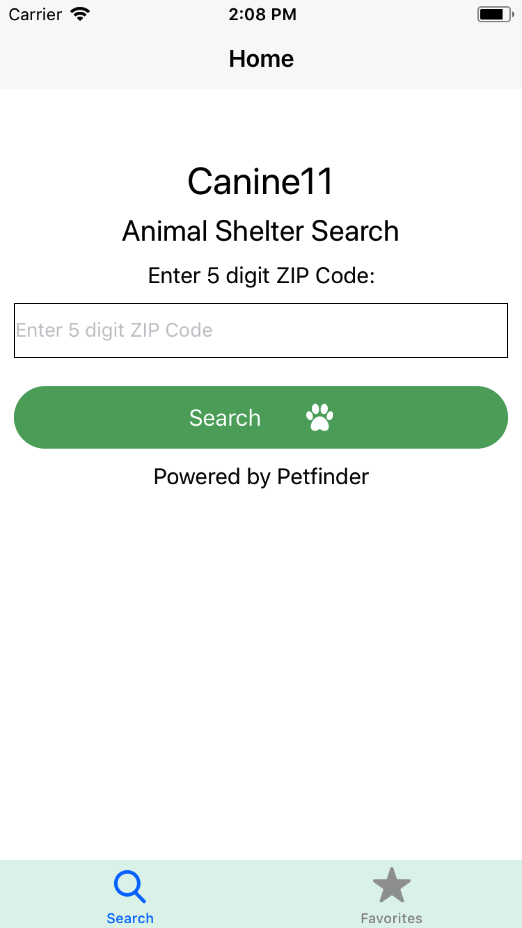
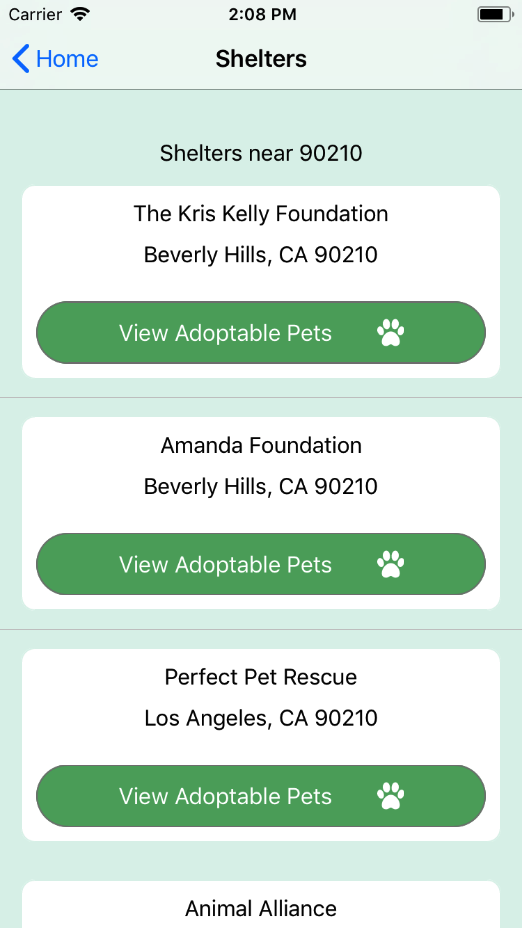
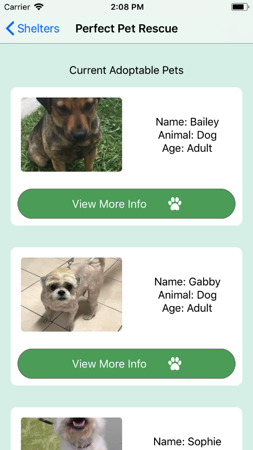
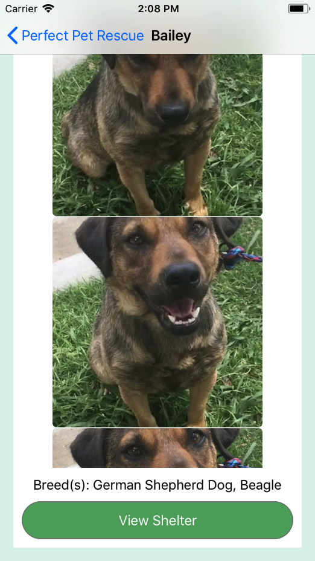

# Canine11

> Petfinder Shelter Search

## Team

  - Benjamin Bucca

## Table of Contents

1. [Usage](#Usage)
1. [Development](#Development)
1. [App Screenshots](#Screenshots)

## Usage

> Search for pets in animal shelters via any 5 digit US zip code. Search results are from Petfinder.com API. Built with Reach Native, tailored towards iOS.
> In order to use, visit Petfinder.com and register for a personal API key.
> Create index.js under the api folder and paste in your API key (see example.js format under api folder).

## Development

From within the root directory:

```sh
yarn install
yarn start
```
Switch to new terminal tab:

```sh
react-native run-ios
```
Wait for simulator to launch:

```sh
CMD + D
Debug JS Remotely
```
Open browser (if one doesn't open automatically) and open console:

```sh
Allow
Able to view API requests and responses (in console)
```

## Screenshots



